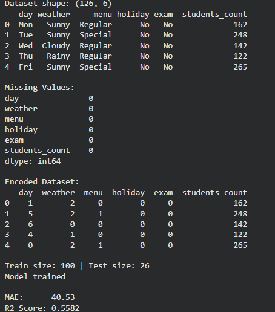
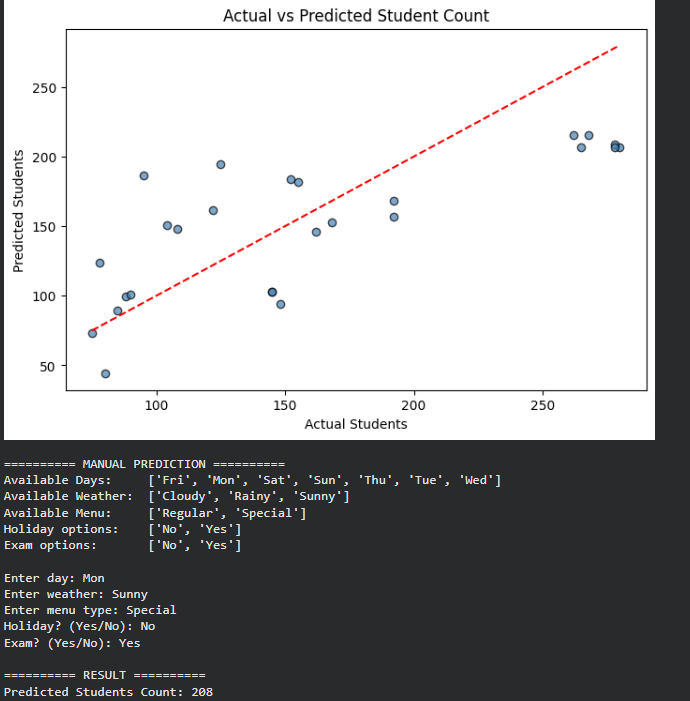

# smart-mess-food-demand-prediction
Smart Mess Food Demand Prediction
A Machine Learning project that predicts the number of students who will opt for meals each day in a college mess, helping reduce food wastage and optimize resource planning.

Problem Statement
A college mess faces issues like food wastage or shortage due to unpredictable student attendance. This project builds a regression model to forecast daily meal demand based on factors like day, weather, menu type, holidays, and exam schedules.

Dataset
ColumnDescriptiondayDay of the week (Mon to Sun)weatherWeather condition (Sunny, Cloudy, Rainy)menuMenu type (Regular, Special)holidayWhether it is a holiday (Yes, No)examWhether exams are scheduled (Yes, No)students_countNumber of students who opted for meals (Target)

Total Records: 126
No missing values

Approach

Loaded and explored the dataset
Checked for missing values
Applied Label Encoding to convert text columns into numbers
Split data into 80% training and 20% testing
Trained a Linear Regression model
Evaluated using MAE and R2 Score
Plotted Actual vs Predicted graph
Built manual input prediction at the end

Algorithm Used
Linear Regression
Linear Regression finds the best fit line through the data points. It learns the relationship between input features (day, weather, menu, holiday, exam) and the target (students_count). When new input is given, it uses that relationship to predict the output.

Libraries Used

pandas
scikit-learn
matplotlib

How to Run

Open Google Colab
Create a new notebook
Paste the code from mess_prediction.py
Run the cell and upload the dataset CSV when prompted
Enter manual inputs at the end to get a prediction

Results

The model successfully predicts daily student count based on given factors
Actual vs Predicted graph shows the model's accuracy visually
MAE and R2 Score are printed after evaluation

Output

Team

Department: Computer Science and engineering
Sharan H.S
Sharath T
Prajwal S.M
Rohith N.V
Subject: ETC515O - Introduction to AI and Its Applications
